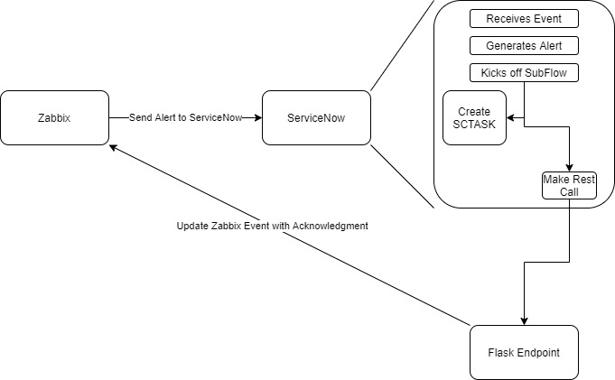
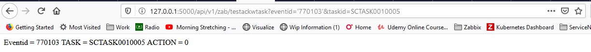

# ServiceNow to Zabbix

This flask application is designed to work to accept rest calls from ServiceNow and based on the request perform Zabbix API functions. Please check the [release log](releaselog.md) for exact changes.

The api currently has two supported functions.

- testackwtask
- ackwtask

These paths are part of the /api/v1/zab path. The testackwtask is just a simple test which will parse out the arguements and return them to you. The ackwtask will utilize the zabbix api to acknowledge a specific event with a task/incident number that was created by Servicenow.



## Requirements

- Zabbix version 3.2+
- ServiceNow New York+
- a config.ini file created in this project

## config.ini

The config.ini file should be created in the root directory of the project. This should have the following values associated to it.

- URL #The url to your zabbix instance
- USER #The zabbix username
- PWD #The password for your api user
- ACTION # The value for action. Typically this is 0 until version 4.2 which implemented multiple values. In which case a value of 6 should suffice for acknowledgement to tell zabbix to acknowledge the event and pass a message.

The section of the config.ini is tied to an env variable called ZBX_ENV. If this value is not set, it will default to a value of 'NPROD'

### testackwtask

This call performs a simple parse of the parameters and api call and responds with that data. It is simply a test fuction.

```bash
/api/v1/zab/testackwtask
```


Required Parameters

- eventid # This value accepts url encoded strings/integers. it will decode it and make it an integer as part of the script
- taskid # This value is expecting a string

Eventid should map to a zabbix eventid and taskid could be a servicenow task number or incident number.

### ackwtask

This call will parse the parameters and make an api call to the zabbix instance to acknowledge the alert provided by the eventid parameter with the taskid details.

```bash
/api/v1/zab/ackwtask
```

Required Parameters

- eventid # This value accepts url encoded strings/integers. it will decode it and make it an integer as part of the script
- taskid # This value is expecting a string

Eventid should map to a zabbix eventid and taskid could be a servicenow task number or incident number.
